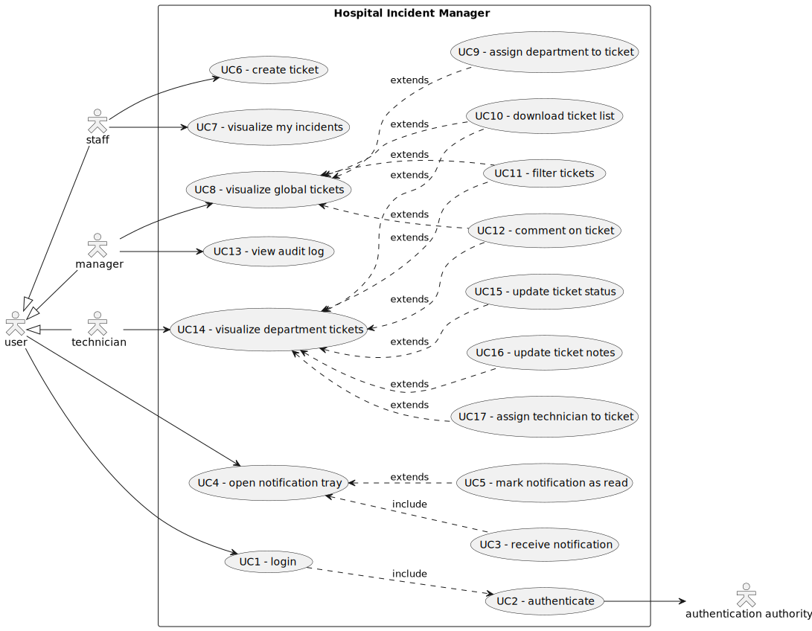
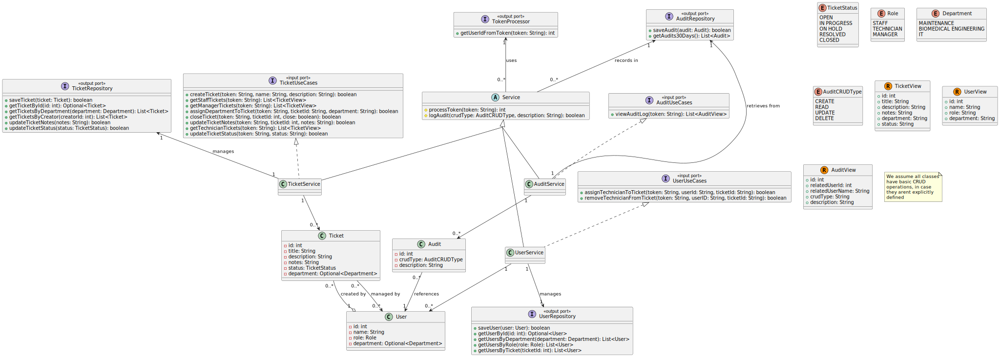

# Hospital Incident Manager

The intention behind this project is twofold: to put my knowledge of app design, planning and development into practice and to create a portfolio.

As I have no GUI development experience at the start of this project, I plan to create a command-line interface (CLI) front end.
However, I intend to create a graphical user interface for this project in the future, so I will implement a modular architecture to allow for this and other potential changes.

The rest of this document will serve as a record of my work, complete with diagrams and information.

---

# System Requirements

In this phase, I used ChatGPT to create an interview from which I could extract the programme requirements based on my intended actions.

## Conversation with the client

- Dr. Ruiz: Hello! Thanks for coming. We’ve been needing something like this for a while. The way we’re currently tracking incidents… well, we’re not, really.
- Me: No problem. I’d be happy to help. Could you tell me what kinds of incidents you need to track?
- Dr. Ruiz: Sure. We have equipment failures — monitors not working, infusion pumps acting up — and also infrastructure issues, like air conditioning failures in operating rooms or water leaks. Then we have IT problems too: system outages, login issues, things like that. And we need to make sure those are addressed quickly.
- Me: Understood. So the idea would be to let hospital staff report these problems as they happen?
- Dr. Ruiz: Exactly. Doctors, nurses, admin staff… anyone should be able to report an incident. We just need a place where they can describe what’s wrong and submit it so it reaches the right team.
- Me: Who would be receiving and handling those reports?
- Dr. Ruiz: Depending on the type of incident, it might go to maintenance, biomedical engineering, or IT. Right now I think just having a shared queue is fine — we’ll sort them internally. Later on we can think about routing by category.
- Me: Makes sense. Would staff need to track the status of their reported incidents?
- Dr. Ruiz: Yes, that’s important. People should be able to see if their issue has been received, if it’s being worked on, if it’s resolved, and so on. It helps avoid confusion and follow-up calls.
- Me: And should the technicians or response teams update the status themselves?
- Dr. Ruiz: Yes. Ideally, whoever is working on an incident can write notes, update the status, and maybe even assign it to someone else on their team if needed.
- Me: How about access levels? Should everyone be able to see everything?
- Dr. Ruiz: No, definitely not. Regular users should only see their own reports. Technicians can see everything in their department. And people like me — managers — should be able to see the full picture across all departments.
- Me: Understood. Would you need reporting features, like seeing stats on the number of incidents or response times?
- Dr. Ruiz: Eventually, yes. For now, just being able to download a list of incidents or filter by date, type, or department would be useful.
- Me: What kind of interface would be easiest for staff to use?
- Dr. Ruiz: I imagine we’ll start small, so a terminal interface or a simple command-line tool is okay for now. But please build it in a way that we can add a proper interface later — maybe web-based or even on tablets — without having to start over.
- Me: Okay. And do you use any existing software for this right now?
- Dr. Ruiz: No, it’s all word of mouth or calls to maintenance. Some departments have spreadsheets. But there’s no central system, and that’s a problem.
- Me: Got it. And just to be clear — would this system handle any patient-related information?
- Dr. Ruiz: No. This is strictly for operational incidents — not clinical events or patient records. Those are handled separately with medical reporting systems.
- Me: That’s good to know. Anything else you’d want to have in the future?
- Dr. Ruiz: Maybe notifications — email or internal alerts when something is urgent or when someone comments on your ticket. But that’s not a must-have yet.
- Me: All right. That’s very helpful. I’ll start from here and design a solution you can grow into.
- Dr. Ruiz: Great. Looking forward to it!

## Requirements extraction

The client's expectations of the product are formalised and specified in the system requirements. They help me to visualise, segment and organise the product's development.

### Functional Requirements

The functionality of a program is determined by its functional requirements, which specify what users can and cannot do.

| ID   | Description                                                                                                                                                                                         | Priority | Acceptance Criteria                                                                                                                                                                          |
| ------ | ----------------------------------------------------------------------------------------------------------------------------------------------------------------------------------------------------- | ---------- | ---------------------------------------------------------------------------------------------------------------------------------------------------------------------------------------------- |
| FR1  | As a member of the hospital staff, I want to be able to log any incidents pertaining to equipment, infrastructure or IT so that the right team can take care of them.                               | High     | Any member of the hospital staff can log incidents about equipment malfunction, infrastructure issues and IT problems.                                                                       |
| FR2  | As a maintenance worker, a biomedical engineer or an IT worker, I want to be able to visualize all the reported incidents assigned to my department so that I can take care of them.                | High     | All of the reported incidents must be visible to all users categorized as maintenance, biomedical engineering or IT, depending on the department they are assigned by the manager.           |
| FR3  | As a member of the hospital staff, I want to be able to track the incident I reported so that I know if it's being worked on, resolved and so on.                                                   | Medium   | Any member of the hospital staff can access the status of all the incidents they reported at any given time.                                                                                 |
| FR4  | As a technician, I want to be able to write notes, update its status and assign other users on my team to the incident so that I can sort it out correctly and in an orderly manner.                | High     | Any maintenance worker, biomedical engineer and IT worker must be able to write notes, update the incident's status and assign other users to it.                                            |
| FR5  | As a manager, I can visualize all the reported incidents and assign them to a department, so that I can sort them correctly.                                                                        | High     | Any manager can visualize all the reported incidents, as well as assign them to a department between maintenance, biomedical engineering and IT.                                             |
| FR6  | As a manager or technician, I want to be able to filter the incidents I have access to by date, type and/or department, as well as downloading the list so that I can manage them more effectively. | Medium   | Any user with the role of manager, maintenance, biomedical engineering or IT can filter their visible incidents by date, type and/or department, as well as download the list of incidents.  |
| FR7  | As a user of the system, I want to be able to use the program through a CLI so that I can access its functionality as early as possible.                                                            | High     | Any user can access the program's functionality through a CLI.                                                                                                                               |
| FR8  | As a user of the system, I want to be able to use the program through a GUI so that I can use the program in an easy and intuitive manner.                                                          | Low      | Any user can access the program's functionality through a GUI. The GUI must replicate the CLI’s functionality and be usable with mouse and keyboard.                                        |
| FR9  | As a member of staff, I want to receive an internal notification when someone comments on my reported incident so that I can respond if needed.                                                     | Low      | When someone comments on an incident, the author will be notified internally.                                                                                                                |
| FR10 | As a manager or technician, I want to receive an internal notification when an urgent incident comes up so that it can be solved swiftly.                                                           | Low      | When an urgent incident is issued, all the managers will get an internal notification, and when this incident is categorized, the members of the target department will be notified as well. |
| FR11 | As a user, I want to authenticate myself to the system so that I can access my information and permissions.                                                                                         | High     | All users must be authenticated in order to preserve role order.                                                                                                                             |

### Non-Functional Requirements

Non-functional requirements affect the underlying characteristics of a program that users probably won't notice. They are more geared towards the development team and the program's overall quality.

| ID   | Category        | Description                                                                                                                                                                                                                                         | Priority |
| ------ | ----------------- | ----------------------------------------------------------------------------------------------------------------------------------------------------------------------------------------------------------------------------------------------------- | ---------- |
| NFR1 | Maintainability | The application must be developed in a modular fashion, maintaining the business domain independent from persistence and view so that they can be changed in the future.                                                                            | MUST     |
| NFR2 | Extensibility   | The application must be designed in a way that allows for future functionality.                                                                                                                                                                     | SHOULD   |
| NFR3 | Security        | All users on the program shall be identified through user name and password, and have roles allowing them to access just the information pertaining to their work. As well as this, every action taken by each user must be logged in an audit log. | MUST     |
| NFR4 | Reliability     | The system must log correctly all incidents and carry out every command it is ordered to without fail.                                                                                                                                              | SHOULD   |
| NFR5 | Portability     | The system should run correctly on Windows, macOS and Linux environments.                                                                                                                                                                           | SHOULD   |
| NFR6 | Testability     | The business logic should be testable independently of the user interface and data storage.                                                                                                                                                         | SHOULD   |

### ASRs - Architecture-significant requirements

ASRs are a subset of the aforementioned requirements that directly impact the architecture under development. In other words, they force or strongly suggest certain design decisions.

| ID   | R-ID | Description                                                                                        | Architectural Implication                                                                                                                                            |
| ------ | ------ | ---------------------------------------------------------------------------------------------------- | ---------------------------------------------------------------------------------------------------------------------------------------------------------------------- |
| ASR1 | FR4  | Users assigned to an incident must be able to add notes, update its status and assign other users. | Requires well-defined control flow and permission handling at the domain level. May influence the design of the use case layer and the access control mechanism.     |
| ASR2 | FR7  | The system must be accessible via a CLI interface.                                                 | Presentation must be decoupled from the business logic to allow interface substitution. This implies the need for a layered or hexagonal architecture.               |
| ASR3 | FR8  | The system must be usable through a GUI in the future.                                             | Reinforces the need for separation between domain and interface logic. The system must be extensible at the presentation layer without affecting core functionality. |
| ASR4 | FR10 | Internal notifications must be sent when urgent incidents arise.                                   | May require the introduction of an event system or a publish-subscribe pattern. This affects both the domain and infrastructure layers.                              |
| ASR5 | NFR1 | Maintainability: the domain logic must remain independent from persistence and presentation.       | Justifies adopting a modular, decoupled architecture (e.g., hexagonal or layered). Enables long-term maintainability and testing.                                    |
| ASR6 | NFR3 | Security: users must only access data relevant to their role.                                      | Requires an authentication and role-based authorization mechanism, enforced across all entry points of the application.                                              |

These ASRs justify the selection of a clean, layered or hexagonal architecture for the project. They highlight the importance of separating concerns across domain, interface, and infrastructure components, and call for flexible, testable, and scalable design patterns from the early stages of development.

# System Views

For the views of the product I'll be developing, I've chosen the 4+1 scheme, which consists on:

1. Logical View:
   - Focuses on the functional requirements of the system: the structure of the domain, key abstractions, and how they relate.
2. Development View:
   - Describes the software’s organization in the development environment, including modules, layers, and packages.
3. Process View:
   - Describes the system’s dynamic behavior, including concurrency, communication between processes, and runtime performance.
4. Physical View:
   - Focuses on the infrastructure, showing how the system is deployed across physical hardware (servers, devices, network).

- Scenarios View:
  - Captures use cases or scenarios that describe typical interactions between users and the system. This view is used to validate the other four.

I'll start with the scenarios view, since it will act as the foundation for all the other views and is more easily obtained from the system requirements.

## Scenarios View

### Diagram

### Catalogue

- **User**: The general user of the program, whatever this actor can do is an action that any person can do.
- **Staff**: The staff working at the hospital, such as doctors, nurses or janitors.
- **Technician**: The people in charge of resolving the logged incidents, which includes maintenance workers, biomedical engineers and IT workers.
- **Manager**: The ones taking control over the system, overseeing all activity in the application.
- **Authentication authority**: System used by the organisation for a safe authentication of the users.

### Extended use cases

| Use Case            | UC1 - Login                                                                                                                                                                                                                                                                                                                                                                                                                                     |
| --------------------- | ------------------------------------------------------------------------------------------------------------------------------------------------------------------------------------------------------------------------------------------------------------------------------------------------------------------------------------------------------------------------------------------------------------------------------------------------- |
| **Description**     | The user logs into the system in order to be assigned their corresponding roles.                                                                                                                                                                                                                                                                                                                                                                |
| **Actors**          | - User - Authentication Authority                                                                                                                                                                                                                                                                                                                                                                                                            |
| **Preconditions**   | -                                                                                                                                                                                                                                                                                                                                                                                                                                               |
| **Main Flow**       | 1.1. - The user clicks the "Log In" button. 1.2. - The system shows the login dialog to the user. 1.3. - The user fills in their user name and their password, then clicks on "Log In". 1.4. - The systems validates the credentials and sends the user to the API by the authentication authority. 1.5. - The authentication authority returns the correct token. 1.6. - The system takes the user to the main page of the app. |
| **Alternate Flows** | 1.3.1. - The credentials are incorrect. 1.3.2. - 1.3.  1.4.1. - The API fails to authenticate the user. 1.4.2. - 1.3.                                                                                                                                                                                                                                                                                                               |
| **Postconditions**  | The user is logged in.                                                                                                                                                                                                                                                                                                                                                                                                                          |

| Use Case            | UC4 - Open notification tray                                                                                                                                                                                                                                                                     |
| --------------------- | -------------------------------------------------------------------------------------------------------------------------------------------------------------------------------------------------------------------------------------------------------------------------------------------------- |
| **Description**     | The user opens their notification tray in order to manage their notifications.                                                                                                                                                                                                                   |
| **Actors**          | - User                                                                                                                                                                                                                                                                                           |
| **Preconditions**   | - The user is logged in.                                                                                                                                                                                                                                                                         |
| **Main Flow**       | 4.1. - The user clicks the notifications icon. 4.2. - The system shows the notifications, or lack thereof, to the user. 4.3. - The user clicks the X button. 4.4. - The system closes the notification tray.                                                                            |
| **Alternate Flows** | *PRECONDITION: There is at least 1 notification in the tray* 4.2.1. - The user clicks on a notification. 4.2.2. - The system expands the notification and, if unread, marks the notification as read. If another notification is already expanded, it will be contracted. 4.2.3. - 4.2. |
| **Postconditions**  | -                                                                                                                                                                                                                                                                                                |

| Use Case            | UC6 - Create ticket                                                                                                                                                                                                                                                                                                                                                                  |
| --------------------- | -------------------------------------------------------------------------------------------------------------------------------------------------------------------------------------------------------------------------------------------------------------------------------------------------------------------------------------------------------------------------------------- |
| **Description**     | The user creates an incident ticket.                                                                                                                                                                                                                                                                                                                                                 |
| **Actors**          | - Staff                                                                                                                                                                                                                                                                                                                                                                              |
| **Preconditions**   | - The user is logged in as staff. - The user is at the homepage                                                                                                                                                                                                                                                                                                                   |
| **Main Flow**       | 6.1. - The user clicks on the "create ticket" button. 6.2. - The system takes the user to the ticket creation screen. 6.3. - The user logs the ticket title and description, as well as attaching any files pertaining to the incident. 6.4. - The system creates the ticket with the status "OPEN", logs the creation in the audit log and takes the user to the homepage. |
| **Alternate Flows** | 6.3.1. - The user leaves either the title or the description blank. 6.3.2. - The system shows an error message informing the user that those fields are mandatory to create a ticket. 6.3.3. - 6.3.  6.2.1. - The user clicks the X button. 6.2.2. - The system takes the user to the homepage.                                                                       |
| **Postconditions**  | -                                                                                                                                                                                                                                                                                                                                                                                    |

| Use Case            | UC7 - Visualize my incidents                                                                                                                                                                                                                                                                           |
| --------------------- | -------------------------------------------------------------------------------------------------------------------------------------------------------------------------------------------------------------------------------------------------------------------------------------------------------- |
| **Description**     | The user visualizes the tickets they have previously created.                                                                                                                                                                                                                                          |
| **Actors**          | - Staff                                                                                                                                                                                                                                                                                                |
| **Preconditions**   | - The user is logged in as staff. - The user is at the homepage.                                                                                                                                                                                                                                    |
| **Main Flow**       | 7.1. - The user clicks the "my tickets" button. 7.2. - The system takes the user to the "my tickets" page, where all the tickets created by the user, or lack thereof, are displayed. 7.3. - The user clicks on the X button. 7.4. - The system takes the user back to the homepage.          |
| **Alternate Flows** | *PRECONDITION: There is at least 1 notification in the tray* 7.2.1. - The user clicks on a ticket. 7.2.2. - The system expands the ticket, showing the description and the notes that any maintenance worker may have left. It will contract any other ticket if it's expanded. 7.2.3. - 7.2. |
| **Postconditions**  | -                                                                                                                                                                                                                                                                                                      |

| Use Case            | UC8 - Visualize global tickets                                                                                                                                                                                                                                                                                                                                                                                                                                                                                                                                                                                                                                                                                                                                                                                                                                                                                                                                                                                                                                                                                                                                                                                                                                                                                                                                                                                                                                                                                                                                                                                                                                                                                                                                                                                              |
| --------------------- | ----------------------------------------------------------------------------------------------------------------------------------------------------------------------------------------------------------------------------------------------------------------------------------------------------------------------------------------------------------------------------------------------------------------------------------------------------------------------------------------------------------------------------------------------------------------------------------------------------------------------------------------------------------------------------------------------------------------------------------------------------------------------------------------------------------------------------------------------------------------------------------------------------------------------------------------------------------------------------------------------------------------------------------------------------------------------------------------------------------------------------------------------------------------------------------------------------------------------------------------------------------------------------------------------------------------------------------------------------------------------------------------------------------------------------------------------------------------------------------------------------------------------------------------------------------------------------------------------------------------------------------------------------------------------------------------------------------------------------------------------------------------------------------------------------------------------------- |
| **Description**     | The user visualizes all the tickets in the system, and is able to assign them a department, comment on them, filter them and download them.                                                                                                                                                                                                                                                                                                                                                                                                                                                                                                                                                                                                                                                                                                                                                                                                                                                                                                                                                                                                                                                                                                                                                                                                                                                                                                                                                                                                                                                                                                                                                                                                                                                                                 |
| **Actors**          | - Manager                                                                                                                                                                                                                                                                                                                                                                                                                                                                                                                                                                                                                                                                                                                                                                                                                                                                                                                                                                                                                                                                                                                                                                                                                                                                                                                                                                                                                                                                                                                                                                                                                                                                                                                                                                                                                   |
| **Preconditions**   | - The user is logged in as a manager. - The user is at the homepage.                                                                                                                                                                                                                                                                                                                                                                                                                                                                                                                                                                                                                                                                                                                                                                                                                                                                                                                                                                                                                                                                                                                                                                                                                                                                                                                                                                                                                                                                                                                                                                                                                                                                                                                                                     |
| **Main Flow**       | 8.1. - The user clicks the "tickets" button. 8.2. - The system takes the user to the tickets page, where all the tickets in the system, or lack thereof, are displayed. 8.3. - The user clicks on the X button. 8.4. - The system takes the user back to the homepage.                                                                                                                                                                                                                                                                                                                                                                                                                                                                                                                                                                                                                                                                                                                                                                                                                                                                                                                                                                                                                                                                                                                                                                                                                                                                                                                                                                                                                                                                                                                                             |
| **Alternate Flows** | 8.2.a.1. - The user clicks on the "download" button. 8.2.a.2. - The system generates a PDF file containing a list with all the tickets expanded. If the list is empty, the PDF file will be generated anyways. 8.2.a.3. - 8.2.  8.2.b.1. - The user clicks on the "filters" button. 8.2.b.2. - The system displays the filter options, which are date, type and department. 8.2.b.3. - The user selects the filters they desire. 8.2.b.4. - The system applies the filters selected. 8.2.b.5. - 8.2.  *PRECONDITION: There is at least 1 ticket* 8.2.c.1. - The user clicks on a ticket. 8.2.c.2. - The system expands the ticket, showing its description and the notes it has attached. If there is another ticket expanded, the system compacts it again. 8.2.c.3. - 8.2.  8.2.c.2.a.1. - The user clicks on the "department" button. 8.2.c.2.a.2. - The system deploys a drop-down menu with the options "maintenance", "biomedical engineering" and "IT". 8.2.c.2.a.3. - The user selects the option they desire. 8.2.c.2.a.4. - The system updates the ticket's department and logs the change in the audit log. 8.2.c.2.a.5. - 8.2.c.2.  8.2.c.2.b.1. - The user clicks on the "notes" button. 8.2.c.2.b.2. - The system opens the text field containing all the ticket's notes. 8.2.c.2.b.3. - The user changes the notes as they desire and clicks "save". 8.2.c.2.b.4. - The system saves the notes and logs the change in the audit log. 8.2.c.2.b.5. - 8.2.c.2.  8.2.c.2.c.1. - The user clicks on the "closed" checkbox. 8.2.c.2.c.2. - If the checkbox is active, the status of the ticket changes to CLOSED and can't be changed nor seen by technicians. If not, the status changes to OPEN. 8.2.c.2.c.3. - 8.2.c.2. |
| **Postconditions**  | -                                                                                                                                                                                                                                                                                                                                                                                                                                                                                                                                                                                                                                                                                                                                                                                                                                                                                                                                                                                                                                                                                                                                                                                                                                                                                                                                                                                                                                                                                                                                                                                                                                                                                                                                                                                                                           |

| Use Case            | UC13 - View audit log                                                                                                                                                                        |
| --------------------- | ---------------------------------------------------------------------------------------------------------------------------------------------------------------------------------------------- |
| **Description**     | The user views the audit log.                                                                                                                                                                |
| **Actors**          | - Manager                                                                                                                                                                                    |
| **Preconditions**   | - The user is logged in as a manager. - The user is at the homepage.                                                                                                                      |
| **Main Flow**       | 13.1. - The user clicks on the "audit log" button. 13.2. - The system shows the audit log. 13.3. - The user clicks the X button. 13.4. - The system takes the user to the homepage. |
| **Alternate Flows** | -                                                                                                                                                                                            |
| **Postconditions**  | -                                                                                                                                                                                            |

| Use Case            | UC14 - Visualize department tickets                                                                                                                                                                                                                                                                                                                                                                                                                                                                                                                                                                                                                                                                                                                                                                                                                                                                                                                                                                                                                                                                                                                                                                                                                                                                                                                                                                                                                                                                                                                                                                                                                                                                                                                                                                                                                                                                                                                                                                                                                                                                                                                                                                                                  |
| --------------------- | -------------------------------------------------------------------------------------------------------------------------------------------------------------------------------------------------------------------------------------------------------------------------------------------------------------------------------------------------------------------------------------------------------------------------------------------------------------------------------------------------------------------------------------------------------------------------------------------------------------------------------------------------------------------------------------------------------------------------------------------------------------------------------------------------------------------------------------------------------------------------------------------------------------------------------------------------------------------------------------------------------------------------------------------------------------------------------------------------------------------------------------------------------------------------------------------------------------------------------------------------------------------------------------------------------------------------------------------------------------------------------------------------------------------------------------------------------------------------------------------------------------------------------------------------------------------------------------------------------------------------------------------------------------------------------------------------------------------------------------------------------------------------------------------------------------------------------------------------------------------------------------------------------------------------------------------------------------------------------------------------------------------------------------------------------------------------------------------------------------------------------------------------------------------------------------------------------------------------------------- |
| **Description**     | The user visualizes the tickets assigned to their department, and is able to comment on them, filter them and download them.                                                                                                                                                                                                                                                                                                                                                                                                                                                                                                                                                                                                                                                                                                                                                                                                                                                                                                                                                                                                                                                                                                                                                                                                                                                                                                                                                                                                                                                                                                                                                                                                                                                                                                                                                                                                                                                                                                                                                                                                                                                                                                         |
| **Actors**          | - Technician                                                                                                                                                                                                                                                                                                                                                                                                                                                                                                                                                                                                                                                                                                                                                                                                                                                                                                                                                                                                                                                                                                                                                                                                                                                                                                                                                                                                                                                                                                                                                                                                                                                                                                                                                                                                                                                                                                                                                                                                                                                                                                                                                                                                                         |
| **Preconditions**   | - The user is logged in as a technician (Maintenance, Biomedical Engineer or IT Worker). - The user is at the homepage.                                                                                                                                                                                                                                                                                                                                                                                                                                                                                                                                                                                                                                                                                                                                                                                                                                                                                                                                                                                                                                                                                                                                                                                                                                                                                                                                                                                                                                                                                                                                                                                                                                                                                                                                                                                                                                                                                                                                                                                                                                                                                                           |
| **Main Flow**       | 14.1. - The user clicks the "tickets" button. 14.2. - The system takes the user to the tickets page, where all the non-closed tickets assigned to their department, or lack thereof, are displayed. 14.3. - The user clicks on the X button. 14.4. - The system takes the user back to the homepage.                                                                                                                                                                                                                                                                                                                                                                                                                                                                                                                                                                                                                                                                                                                                                                                                                                                                                                                                                                                                                                                                                                                                                                                                                                                                                                                                                                                                                                                                                                                                                                                                                                                                                                                                                                                                                                                                                                                        |
| **Alternate Flows** | 14.2.a.1. - The user clicks on the "download" button. 14.2.a.2. - The system generates a PDF file containing a list with all the tickets expanded. If the list is empty, the PDF file will be generated anyways. 14.2.a.3. - 14.2.  14.2.b.1. - The user clicks on the "filters" button. 14.2.b.2. - The system displays the filter options, which are date and type. 14.2.b.3. - The user selects the filters they desire. 14.2.b.4. - The system applies the filters selected. 14.2.b.5. - 14.2.  *PRECONDITION: There is at least 1 ticket* 14.2.c.1. - The user clicks on a ticket. 14.2.c.2. - The system expands the ticket, showing its description and the notes it has attached. If there is another ticket expanded, the system compacts it again. 14.2.c.3. - 14.2.  14.2.c.2.a.1. - The user clicks on the "notes" button. 14.2.c.2.a.2. - The system opens the text field containing all the ticket's notes. 14.2.c.2.a.3. - The user changes the notes as they desire and clicks "save". 14.2.c.2.a.4. - The system saves the notes and logs the change in the audit log. 14.2.c.2.a.5. - 14.2.c.2.  14.2.c.2.b.1. - The user clicks on the "assigned technicians" button. 14.2.c.2.b.2. - The system opens a list of all the technicians, or lack thereof, in the department assigned to the ticket, if any of them are already assigned to the task have their checkbox selected. 14.2.c.2.b.3. - The user clicks the X button. 14.2.c.2.b.4. - The changes the list of the assigned technicians to the ones with their checkbox selected. 14.2.c.2.b.5. - 14.2.c.2.  *PRECONDITION: There is at least 1 technician in the ticket's department* 14.2.c.2.b.2.1. - The user clicks on the checkbox on a technician they desire to select for the task. 14.2.c.2.b.2.2. - 14.2.c.2.b.2.  14.2.c.2.c.1. - The user clicks on the "status" button. 14.2.c.2.c.2. - The system shows a drop-down menu with the options IN PROGRESS, ON HOLD and RESOLVED. 14.2.c.2.c.3. - The user clicks on the desired option. 14.2.c.2.c.4. - The system changes the status to the selected option. 14.2.c.2.c.5. - 14.2.c.2. |
| **Postconditions**  | -                                                                                                                                                                                                                                                                                                                                                                                                                                                                                                                                                                                                                                                                                                                                                                                                                                                                                                                                                                                                                                                                                                                                                                                                                                                                                                                                                                                                                                                                                                                                                                                                                                                                                                                                                                                                                                                                                                                                                                                                                                                                                                                                                                                                                                    |

## Logical View

### Diagram
🚧🚧🚧🚧🚧🚧🚧🚧🚧🚧🚧🚧🚧🚧🚧🚧🚧🚧🚧🚧🚧🚧🚧🚧🚧🚧🚧🚧🚧🚧🚧🚧🚧🚧🚧🚧🚧🚧🚧

🚧🚧🚧🚧🚧🚧🚧🚧🚧🚧🚧🚧🚧🚧🚧🚧🚧🚧🚧🚧🚧🚧🚧🚧🚧🚧🚧🚧🚧🚧🚧🚧🚧🚧🚧🚧🚧🚧🚧
